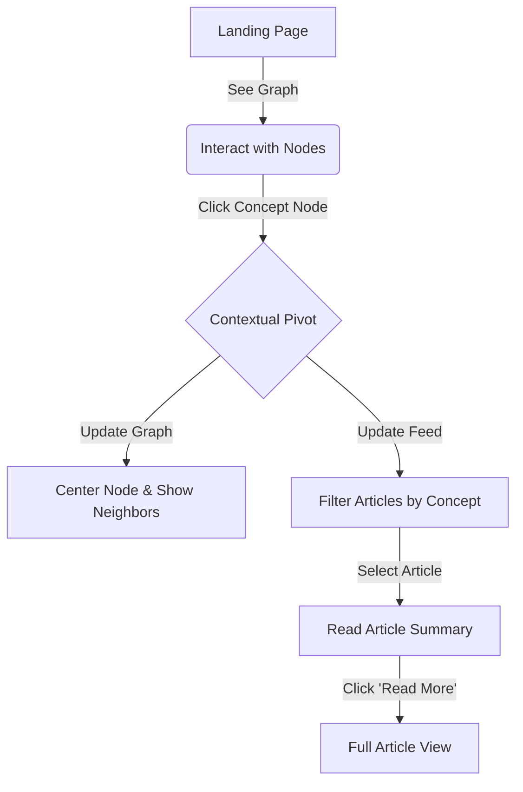
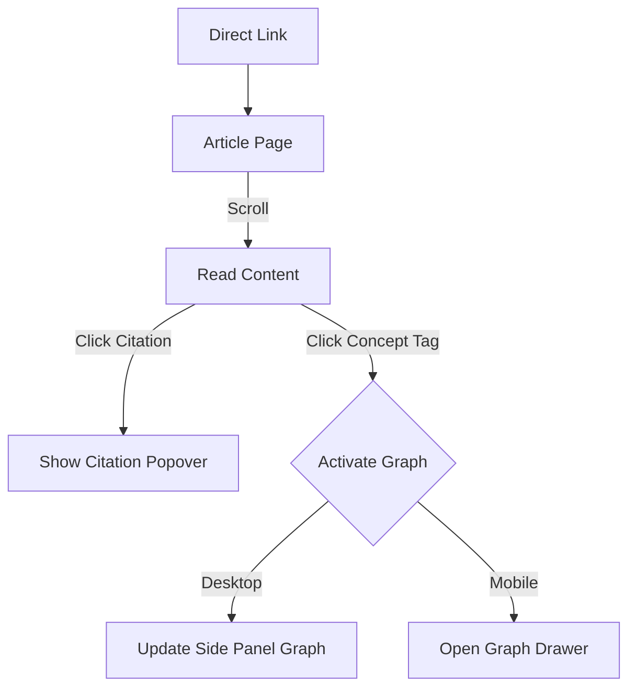
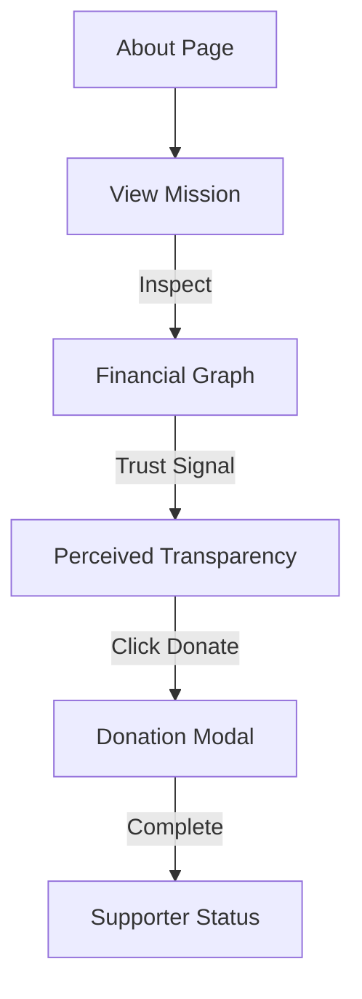

# UX Design Specification cg-iptc

**Author:** Brotherlegend
**Date:** 2025-12-10

---

<!-- UX design content will be appended sequentially through collaborative workflow steps -->

## Executive Summary

### Project Vision
To create a "digital salon" aesthetic—high-efficiency legibility combined with premium motion design. The interface recedes to highlight content (Substack/YouTube) but steps forward with rich interactivity for research tools (Data Viz). It rejects "academic clutter" in favor of "editorial elegance."

### Target Users
*   **The Deep Diver:** Researchers who use the Node Graph to find non-obvious connections.
*   **The Media Consumer:** Students/Fans who binge content across formats without friction.
*   **The Patron:** Donors who judge institutional legitimacy by design quality (Trust Signals).

### Key Design Challenges
*   **Visualizing Complexity:** Making the "Cybernetics" graph intuitive, not overwhelming.
*   **Feed Integration:** Styling RSS content to look 100% native (handling Substack's HTML quirks).
*   **Performance vs. Polish:** heavy animations vs. LCP requirements.

### Design Opportunities
*   **"Living" Citations:** One-click copy interactions that feel rewarding (micro-interactions).
*   **The "Rabbit Hole":** Using the Data Viz as a primary navigation method, not just a chart.

## Core User Experience

### Defining Experience
The experience centers on **"Intellectual Flow."** The user should move from passive consumption (reading an article) to active exploration (graph visualization) without friction. The interface is a "quiet" frame for "loud" ideas.

### Platform Strategy
*   **Web-Native:** Zero install, instant load.
*   **Mobile-First (Safari Focus):** Interactions designed for thumb zones and "Dynamic Island" safe areas.
*   **Desktop Enhancement:** Expands to immersive, wide-screen data visualizations.

### Effortless Interactions
*   **"Living" Citations:** Clicking a citation shouldn't jump to the bottom; it should reveal context in place (Tooltip/Side panel).
*   **Instant Feed:** No "Check for updates" button. It's just there.
*   **Seamless Transition:** Moving from "Article" to "Graph" should feel like zooming out, not changing pages.

### Critical Success Moments
*   **The "Aha" Moment:** When a user clicks a node in the graph and sees a localized cluster of relevant papers.
*   **The "Trust" Moment:** When the site loads instantly on a phone, validating the "Premium" feel.

### Experience Principles
1.  **Content First, Chrome Second:** Interface elements fade away when not in use.
2.  **Motion conveys Meaning:** Animations are for orientation, not decoration.
3.  **Speed is Luxury:** Performance is the primary aesthetic feature.

## Desired Emotional Response

### Primary Emotional Goals
**"I feel smarter using this.**" The tool shouldn't just be effective; it should make the user feel highly capable and intellectually connected.

### Emotional Journey Mapping
1.  **Discovery (Curiosity):** "This looks intriguing." (Graph Visualization).
2.  **Consumption (Focus):** "Nothing is distracting me." (Clean Typography).
3.  **Synthesis (Mastery):** "I found exactly what I needed." (Citation/Export).

### Micro-Emotions
*   **Trust:** Derived from the stability of the animations and speed of the site.
*   **Delight:** Derived from the fluid transition between "Macro" (Graph) and "Micro" (Article).
*   **Exclusivity:** The feeling that this is a "Secret Weapon" for research.

### Design Implications
*   **To create Focus:** Use generous whitespace and strict typographic hierarchy.
*   **To create Trust:** No layout shifts (CLS 0); Loading states must be intentional, not broken.
*   **To create Mastery:** Feedback for every action (copying a link, filtering the graph) must be instant and positive.

### Emotional Design Principles
*   **Clarity = Calm:** Reduce cognitive load to zero.
*   **Responsiveness = Respect:** Respect the user's time with instant feedback.

## UX Pattern Analysis & Inspiration

### Inspiring Products Analysis
*   **Cosmos / Are.na:** For their effortless "knowledge graph" navigation and spatial organization.
*   **Linear:** For the "Speed is Luxury" aesthetic—minimal, high-contrast, instant feedback.
*   **Substack (Reader Mode):** For the "invisible" reading interface that respects the text.

### Transferable UX Patterns
*   **The "Fade Interface" (Linear):** Controls (like citation copy, graph filters) only appear when you hover/need them. The default state is content-only.
*   **Spatial Navigation (Cosmos):** Browsing by "proximity" (what is related to this?) rather than just "chronology" (what is new?).
*   **Unified Typography:** Using a single high-quality typeface family (e.g., Inter/Geist) for *everything* to create cohesion.

### Anti-Patterns to Avoid
*   **The "Academic Portal" Clutter:** Sidebar menus packed with 50 links.
*   **Infinite Scroll Fatigue:** Loading 100 articles without structure. We will use "Curated Clusters" instead.
*   **"Scroll-Jacking":** Taking control of the scroll bar for animations. Motion must be additive, not restrictive.

### Design Inspiration Strategy
*   **Adopt:** Substack's reading measure (characters per line) for perfect readability.
*   **Adapt:** D3/Visx force graphs to feel like Cosmos's "Galaxy" view.
*   **Avoid:** Generic "SaaS" shadows; go for flat, sharp borders (Brutalist/Swiss).

## Design System Foundation

### 1.1 Design System Choice
**Shadcn UI (Radix Primitives + Tailwind CSS).**

### Rationale for Selection
1.  **Ownership (The "Salon" Factor):** Full control to implement "Swiss/Brutalist" aesthetic without fighting library defaults.
2.  **Accessibility (The "Research" Factor):** Radix primitives ensure WCAG compliance for complex interactions (Citations, Graphs).
3.  **Speed:** Tailwind allows rapid global tuning of typography and spacing tokens.

### Implementation Approach
*   **Base:** Tailwind CSS (Utility-first).
*   **Primitives:** Radix UI (Headless interactive logic).
*   **Components:** Custom components based on Shadcn patterns.
*   **Data Viz:** Visx (Airbnb) styled with Tailwind.

### Customization Strategy
*   **Typography:** Strict separation of "Reading" (Serif) and "UI" (Sans) fonts.
*   **Radius:** Zero or minimal radius for the "Brutalist" feel.
*   **Typography:** Strict separation of "Reading" (Serif) and "UI" (Sans) fonts.
*   **Radius:** Zero or minimal radius for the "Brutalist" feel.
*   **Animation:** Global `framer-motion` config for consistent "physics."

## 2. Core User Experience

### 2.1 Defining Experience
**"Contextual Pivoting."** Instead of just clicking a link to go to a new page, the user "pivots" the entire interface around a concept.

### 2.2 User Mental Model
*   **Current:** "I click a link, page loads, I lose context."
*   **New:** "I click a concept, the camera moves, the data rearranges. I never leave the room."

### 2.3 Success Criteria
1.  **Continuity:** The user must never feel "lost" during a transition.
2.  **Instant Gratification:** The graph must settle into its new state within 400ms.
3.  **Clarity:** The new list of articles must be obviously related to the pivoted term.

### 2.4 Novel UX Patterns
**"The Split-Brain Navigation."** We are combining a traditional "List View" (substacks) with a "Spatial View" (graph) that share a single state. Most apps do one or the other. We do both simultaneously.

### 2.5 Experience Mechanics
1.  **Initiation:** User is reading an article summary.
2.  **Interaction:** User clicks a "Tag" pill (e.g., "Cybernetics").
3.  **Feedback:** Left Panel: Graph nodes apply force simulation to center "Cybernetics." Right Panel: Feed filters to show only "Cybernetics" posts.
3.  **Feedback:** Left Panel: Graph nodes apply force simulation to center "Cybernetics." Right Panel: Feed filters to show only "Cybernetics" posts.
4.  **Completion:** The view settles. The user is now exploring "Cybernetics" without a page reload.

## Visual Design Foundation

### Color System
*   **Theme:** "Dark Mode First." (Reduces eye strain for reading).
*   **Background:** `zinc-950` (Deep charcoal, not pure black).
*   **Surface:** `zinc-900` (Subtle separation for cards).
*   **Accent:** `indigo-500` (Cybernetic/Tech feel) & `amber-600` (Highlight/History feel).
*   **Text:** `zinc-100` (Primary) & `zinc-400` (Secondary metadata).

### Typography System
*   **Display (H1-H2):** *Instrument Serif* or *Playfair Display*. High contrast, fast rendering, exudes authority.
*   **Body/UI:** *Inter* or *Geist Sans*. Frictionless legibility. The standard for digital product design.
*   **Mono:** *JetBrains Mono*. For data points, citations, and timestamps.

### Spacing & Layout Foundation
*   **Grid:** 12-column responsive grid with significant gutters (24px+).
*   **Density:** "Relaxed." We trade content density for readability.
*   **Rhythm:** 4px baseline grid. Components use 8px/16px/24px padding tokens.

### Accessibility Considerations
*   **Contrast:** All text meets AAA standards on the dark background.
*   **Focus States:** High-visibility focus rings (cyan/amber) for keyboard navigation.
*   **Contrast:** All text meets AAA standards on the dark background.
*   **Focus States:** High-visibility focus rings (cyan/amber) for keyboard navigation.
*   **Scale:** Type scale uses `rem` units for browser font resizing support.

## Design Direction Decision

### Design Directions Explored
*   **Direction A ("The Codex"):** Text-heavy, split screen, traditional academic layout.
*   **Direction B ("The Node"):** Graph-first, immersive, spatial navigation.
*   **Direction C ("The Stream"):** Feed-first, mobile-style, drawer graph.

### Chosen Direction
**"The Split-Brain Codex"** (Hybrid of A & B).

### Design Rationale
*   **Desktop Split:**  Physically enforces the "Connection" value proposition by showing the map (Graph) and territory (Content) side-by-side.
*   **Mobile Adaptation:** Stacked layout prioritizes reading but keeps the graph accessible via distinct navigation/expansion.
*   **Visual Style:** Brutalist borders clearly demarcate functional zones, avoiding vague shadows.

### Implementation Approach
*   **Desktop:** Resizable split-pane layout (allotment or plain flex).
*   **Mobile:** Collapsible header/drawer for the graph visualization.
*   **Desktop:** Resizable split-pane layout (allotment or plain flex).
*   **Mobile:** Collapsible header/drawer for the graph visualization.
*   **Interaction:** Bidirectional sync (Graph Node Click <-> Feed Filter).

## User Journey Flows

### 1. The "Rabbit Hole" (Exploration)
Users discover unexpected connections through spatial navigation.

### 2. The "Deep Read" (Consumption)
Distraction-free reading with integrated context.

### 3. The "Patron" (Conversion)
Building trust through design quality.

### Journey Patterns
*   **Pivot-First Navigation:** Always offering a way to "pivot" context (via tags/nodes) rather than just "back" buttons.
*   **Popover Citations:** Never forcing the user to leave the reading position to check a source.

### Flow Optimization Principles
*   **Zero Dead Ends:** Every piece of content must link back to the Graph.
### Flow Optimization Principles
*   **Zero Dead Ends:** Every piece of content must link back to the Graph.
*   **State Preservation:** When returning from an article, the Graph must be in the exact same state as left.

## Component Strategy

### Design System Components (Shadcn/Radix)
*   **Popover:** Critical for citations.
*   **Resizable:** The core of the split-pane layout.
*   **ScrollArea:** Essential for independent scrolling of graph vs. text.
*   **Dialog/Modal:** For the "Donate" flow.
*   **Buttons/Inputs:** Standardized for forms.

### Custom Components
*   `GraphCanvas`: A `visx` wrapper handling force simulation, zoom/pan behaviors, and node interactions.
*   `ArticleReader`: A specialized typography container that handles semantic HTML from Substack, enforcing our "Reading" font stack.
*   `SplitShell`: A layout controller that manages the Desktop (Split) vs. Mobile (Stack/Drawer) states.
*   `PivotTag`: An interactive pill that triggers the graph filter action.

### Implementation Roadmap
1.  **Phase 1:** `SplitShell` + `ArticleReader` (Get content on screen).
2.  **Phase 2:** `GraphCanvas` (Get the graph rendering).
### Implementation Roadmap
1.  **Phase 1:** `SplitShell` + `ArticleReader` (Get content on screen).
2.  **Phase 2:** `GraphCanvas` (Get the graph rendering).
3.  **Phase 3:** `PivotTag` + Interaction Logic (Connect the two).

## UX Consistency Patterns

### Button Hierarchy
*   **Primary:** Solid background (`amber-600`). Used sparingly for high-value actions (Donate, Subscribe).
*   **Secondary:** Outline (`zinc-700`). Used for functional actions (Filters, Reset).
*   **Ghost:** Transparent. Used for navigation links and contextual interactions to reduce visual noise.

### Feedback Patterns
*   **Success/Error:** **Toast Notifications** (Sonner). Non-blocking messages that appear at the edge of the screen.
*   **Loading:** **Skeleton Screens**. We show the "shape" of the content to prevent layout shifts (CLS) and maintain a premium feel.

### Empty States
*   **Pattern:** **Vector Suggestions.** Instead of "No results," use the graph logic to suggest "Nearest Neighbors" or broad concepts.
*   **Action:** Always provide a way to "Reset" or "Zoom Out."

### Navigation Patterns
*   **Global Toggle:** A persistent control to toggle between "Graph Mode" and "Reading Mode" on mobile.
### Navigation Patterns
*   **Global Toggle:** A persistent control to toggle between "Graph Mode" and "Reading Mode" on mobile.
*   **Ghost Interaction:** Primary navigation elements remain subtle until hovered, placing focus on content.

## Responsive Design & Accessibility

### Responsive Strategy
*   **Desktop (1024px+):** **Split-Screen**. The Graph is persistent and interactive.
*   **Tablet (768px-1024px):** **Stacked**. Graph is a "Hero" section; scroll to read.
*   **Mobile (<768px):** **Reader-First**. Content is full width. Graph is hidden in a Drawer/Overlay, accessed via a Floating Action Button (FAB).

### Breakpoint Strategy
*   **Mobile:** 320px - 767px
*   **Tablet:** 768px - 1023px
*   **Desktop:** 1024px+

### Accessibility Strategy
*   **Keyboard Navigation:** Graph nodes are tab-stops. Arrow keys explore neighbors.
*   **Screen Readers:** `aria-label` provides node context ("5 connections").
*   **Reduced Motion:** Disable force-simulation physics if `prefers-reduced-motion` is detected.
*   **Touch Targets:** 44px minimum for all touch interactions.

### Testing Strategy
*   **Devices:** Verify "Dynamic Island" safe areas on iOS.
*   **Zoom:** Ensure graph controls work at 200% zoom.
